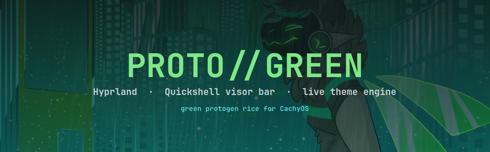
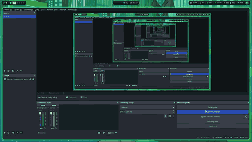
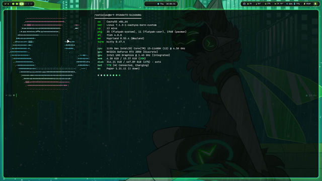
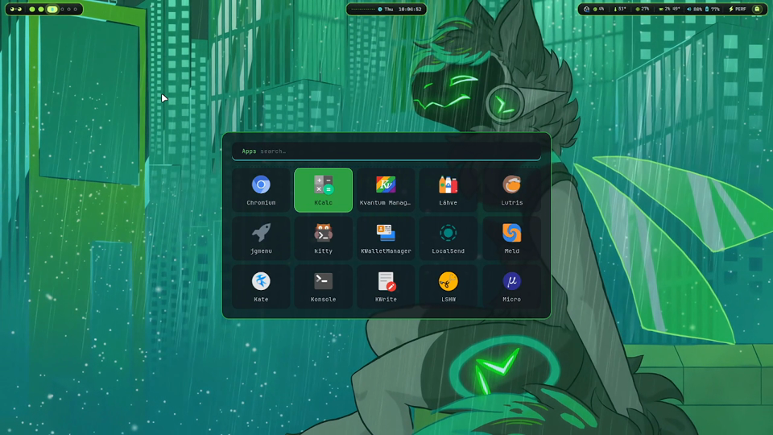
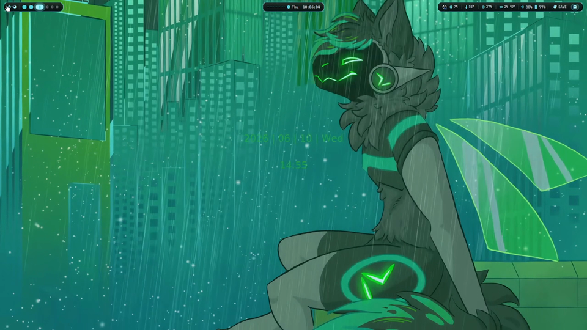

<p align="center">
  
</p>

<p align="center">
  
  
  
  
</p>

<p align="center">
  
</p>

<p align="center">
  <a href="demo/protogreen-demo.mp4"><b>▶ full demo video</b></a> — 49 s, 1080p
</p>

---

A green protogen rice for Hyprland, running as my daily driver on CachyOS. The bar is not
waybar with nicer colours — it's `protogreen`, a Quickshell shell I wrote from scratch: a
visor whose face reacts to what the machine is doing, a HUD, a theme panel that recolours
fifteen config files at once, and a small assistant that can actually drive the desktop.

waybar is still in here as a fallback, one keybind away, because a bar you wrote yourself
breaks in ways a packaged one doesn't.

---

## ⚡ Grab it

Arch or CachyOS:

```bash
git clone https://github.com/WafflingNinja/protogreen.git
cd protogreen
bash install.sh
```

The installer asks before every single step, backs up whatever is already in `~/.config`,
and never overwrites anything in place. Full detail in [Install](#-install) further down.

---

## 🖼 Gallery

<p align="center">
  
  <br><sub>fastfetch + cava, animated wallpaper behind</sub>
</p>

<p align="center">
  
  
  <br><sub>rofi (blurred layer) · bare desktop, bar at the top</sub>
</p>

> The HUD, theme panel and Pip aren't in the demo video — it predates them. The QML is in
> `config/quickshell/protogreen/` if you want to see what they do before installing.

---

## 🟩 Visor online — what it actually is

### The bar

`Bar.qml` · `VisorEye.qml` · `MoodFace.qml` · `components/`

A protogen visor pinned to the top of the screen. Left to right: workspaces, media,
tray, CPU/GPU load and temps, a cava spectrum, battery, power profile, clock. The face in
the middle changes expression with system state, and the eye tracks.

Everything is a QML component (`Island.qml`, `VolumePill.qml`, `BatteryPill.qml`,
`MediaPill.qml`, `Tray.qml`, `Clock.qml`, …) so a module is ~40 lines, not a jsonc entry
and a CSS selector in two different files.

**Why not waybar:** waybar modules are text. A face that reacts, an eye that follows the
cursor and a spectrum analyser are not text. Quickshell gives you actual QML — animations,
shaders, canvas — with Wayland layer-shell handled for you.

### 🎨 Live theme engine

`ThemePanel.qml` + `components/ColorWheel.qml` + `scripts/theme_apply.py` — `SUPER+SHIFT+T`

Pick a colour on a wheel. Everything follows: Hyprland borders, the visor bar, waybar,
rofi, dunst, kitty, cava, fastfetch, GTK3, GTK4, hyprlock, even the keyboard backlight.
No file editing, no relog, no separate "pywal but for X" per app.

Fifteen files are under management:

```
kitty/kitty.conf · kitty/theme.conf · dunst/dunstrc · rofi/config.rasi
rofi/powermenu.rasi · waybar/style.css · hypr/hyprlock.conf · cava/protogreen.conf
fastfetch/config.jsonc · gtk-3.0/{gtk,colors,thunar}.css · gtk-4.0/{gtk,colors,gtk-dark}.css
```

### 🤖 Pip — the optional assistant

`Assistant.qml` · `AssistantPopup.qml` · `assistant/` — `SUPER+A`

A small popup with a protogen personality. Two halves, and **only the second needs
anything installed**:

| half | what it does | needs |
|---|---|---|
| **Commands** | open apps, switch workspaces, volume, brightness, night light, screenshots, lock | nothing |
| **Chat** | free conversation, with a web lookup when it's unsure | ollama + a 2 GB model |

Skip ollama and the rest of the rice doesn't notice. The popup answers *"no model here —
chat needs ollama running"* and keeps doing commands.

No API key anywhere. Nothing is sent off the machine except the DuckDuckGo query, and only
when the model itself admits it doesn't know.

### 📊 HUD

`Hud.qml` — `SUPER+D`

Full-screen dashboard: sensors, toggles (wifi, bluetooth, night light, autoclicker,
crosshair, theme panel, steam-idler), quick tools. Blurred layer; `SUPER+D` again closes it.

### 🔋 Power and wallpaper, decided by one script

`scripts/power-watch.sh`

- **Game starts** → animated wallpaper is dropped, a frozen frame takes its place. Frees
  the iGPU behind windowed games.
- **On battery** → power-saver profile, static wallpaper (~212 MB and a chunk of iGPU
  render saved).
- **On AC** → balanced profile, animated wallpaper back.
- **Manual profile pick from the bar** → the script keeps its hands off the profile until
  you clear it.

### 🖱 Extras

- **Autoclicker** (`F8`) — works in fullscreen games under Wayland.
- **Crosshair overlay** (`F4`) — for games that don't draw one.
- **Screenshots** (`SUPER+SHIFT+S/W`, `Print`) — region / window / full, straight into
  satty for annotation.
- **Sound pack** — short blips on window open, close and workspace switch.
- **Wallpaper converter** — turns a Wallpaper Engine scene into a looping mp4.
- **Showcase mode** (`SUPER+SHIFT+A`) — fastfetch banner + green cava, for screenshots.

---

## 🔧 Under the hood

The parts I'd actually want someone to read.

### 1. One authority for wallpaper and power

Three scripts each deciding "should the wallpaper be animated right now" is how you get a
black desktop. `power-watch.sh` is the only thing allowed to touch the wallpaper or the
power profile. It polls every 3 s, computes the desired state, and acts **only when that
state changes**.

Details that cost me real debugging:

- **Game detection excludes the Steam client.** Matching `pressure-vessel` or
  `steamwebhelper` means the wallpaper vanishes whenever Steam is merely open. The match
  is `reaper SteamLaunch` and `gamescope` — an actual launch.
- **`proton` is not in the regex** on purpose: it substring-matches `protogreen`, my own
  bar, and the wallpaper would never come back.
- **The probe is cached per tick.** Game state is asked three times a tick (apply + two
  self-heals); that was three `pgrep | grep` pairs every 3 s, forever, for one answer.
- **mpvpaper is force-restarted, not trusted.** It can survive as a process with a dead
  GL/vaapi context after the dGPU gets hammered — `pgrep` sees it alive, the self-heal
  never fires, and the screen just stays black.
- **`hyprctl reload` on leaving a game.** Game launchers turn animations off and restore
  them from an EXIT trap that never runs if the game is SIGKILLed. A reload puts every
  keyword back, whichever launcher died.

### 2. The frozen-frame trick

Killing the animated wallpaper during games would leave a black desktop, which looks
broken rather than paused. Instead `ffmpeg` pulls one frame from whatever video is current
and `awww` draws it on the background layer, then does nothing per-frame.

The frame is cached under a key of `path + mtime`, so re-rendering the wallpaper or
swapping it from the theme panel produces a new cache entry automatically, and falls back
to the static PNG if ffmpeg isn't installed.

### 3. Autoclicker through `/dev/uinput`

`xdotool` doesn't work under Wayland, and compositor-level injection doesn't reach
fullscreen games. So `scripts/autoclicker.py` creates a **virtual input device** with
`evdev`'s `UInput` — events enter at the kernel level, the same path a real mouse takes,
below the compositor entirely.

That means it lands in the focused window, on any workspace, fullscreen games included.
It has a self-test (`--selftest`, uses F13 so nothing breaks), configurable cps, hold
time, jitter, double-click and repeat, and a pidfile so running it again toggles it off.
Needs your user in the `input` group; the script says so instead of failing cryptically.

### 4. Pip routes with regex, not with the model

Small models are good at warm conversational prose and **bad at classification**. So Pip
never asks the model what you meant:

```
send(text)
  ├─ _route(text)  → regex match → run the desktop action, canned reply, DONE (no LLM)
  └─ no match      → send to ollama for prose
                      └─ reply "sounds unsure"? → DuckDuckGo → re-answer from results
```

The unsure-detector is one regex over the model's own words (`I'm not sure`,
`as of my last update`, `may have changed`, …). The model doesn't decide to search; it
just talks, and being honest about not knowing is what triggers the lookup.

That split is also why the command half needs no model at all.

### 5. Blur policy

Blur on the bar looks great and costs a re-blur **every frame**, because a persistent
surface over a video wallpaper never stops changing. That was most of the choppiness.

So: blur is enabled for rofi, notifications and the HUD — transient surfaces that only
cost while they're visible — and disabled for bars and windows. Opacity does the rest.

### 6. Wallpaper pipeline

`scripts/wpconvert.sh` · `wpseam.sh` · `wpscan.py`

Running `linux-wallpaperengine` live costs far more than playing a video, so each scene is
rendered to an mp4 **once** and mpvpaper loops it forever.

- The bar is taken down and an empty workspace selected during capture, because
  wallpaper-engine draws to the wallpaper layer and anything floating above it gets baked
  in. An EXIT trap restores all of it — installed *before* the first state change, so
  Ctrl-C and crashes are covered too.
- `wf-recorder` produces variable framerate; a second pass forces CFR, because mpvpaper
  looping a VFR file drifts audibly out of step with itself.
- Scenes aren't periodic, so there's no true loop point. The tail is cross-faded back over
  the head, turning a hard jump into a short dissolve. `wpseam.sh` extracts the two frames
  that meet at the seam and shows them side by side so you can nudge the trim until they
  match.

### 7. Sound listener over Hyprland's IPC socket

No polling, no plugin:

```bash
socat -U - UNIX-CONNECT:"$XDG_RUNTIME_DIR/hypr/$HYPRLAND_INSTANCE_SIGNATURE/.socket2.sock" \
  | while read -r line; do case "$line" in
      openwindow\>\>*)  "$PLAY" open ;;
      closewindow\>\>*) "$PLAY" close ;;
      workspace\>\>*)   "$PLAY" workspace 150 ;;
    esac; done
```

Hyprland pushes events, the shell reacts. That's the whole thing.

### 8. Hybrid GPU choices

Laptop with Intel UHD driving the panel and an RTX 2050 for games:

- `LIBVA_DRIVER_NAME=iHD` — the panel is Intel-driven, so **video decode belongs on the
  iGPU**. NVIDIA's libva fell back to *software* decode here: slower, and it woke the dGPU
  for every video = battery gone.
- `__GLX_VENDOR_LIBRARY_NAME=nvidia` stays, because Xwayland games do want the dGPU.
- **Hardware cursor stays on.** The usual `no_hardware_cursors` workaround exists for
  NVIDIA scanout; this panel is on the Intel plane, so the cursor doesn't double and HW
  cursor costs zero per-frame CPU.
- The cursor theme is **static on purpose** — the previous animated one had 8 frames on
  `left_ptr`, and re-uploading the KMS cursor buffer 8× a cycle stutters the Intel plane.

### 9. Palette derivation

`scripts/theme_palette.py` — imported by *both* the applier and the panel preview, so the
two can never disagree about what a theme means.

A theme is two gradient stops. Everything else (`bg`, `surface`, `accent`, `dim`, `fg`,
`danger`, …) is derived from stop A's hue, so the desktop stays in one colour family, with
a per-theme overrides map for the values you want pinned.

One rule that isn't cosmetic: **reds don't rotate.** `f85149`, `e65a6e`, `ff7b72` and
`53272c` are protected from the hue shift. A delete button that turns lime because the
accent moved is a usability bug, not a style choice.

---

## 📦 Install

Arch or CachyOS. Other distros: see the [FAQ](#-faq).

```bash
git clone https://github.com/WafflingNinja/protogreen.git
cd protogreen
bash install.sh
```

It opens with a disclaimer you have to accept by typing `yes`, then does the following,
asking `[y/N]` before each:

1. **Packages** — one `pacman -S --needed` call. The full list is printed before it runs.
2. **Animated wallpaper** *(optional, AUR)* — `linux-wallpaperengine-git`, only needed to
   convert new Wallpaper Engine scenes.
3. **Pip's chat** *(optional)* — ollama + `llama3.2:3b`, ~2 GB. Say no and everything else
   still works.
4. **Configs** — anything already in `~/.config` is **renamed** to `<name>.bak-<date>`
   first. Nothing is overwritten in place. Fills the `__HOME__` placeholder with your real
   home directory and makes the scripts executable.
5. **GPU profile** — detects your GPU, shows what it's about to write, and swaps the
   marked block in `hyprland.conf`. Say no to pick `nvidia-hybrid` / `amd` / `intel`
   yourself. On AMD this means *removing* the NVIDIA pins rather than adding anything —
   mesa already picks the right VA-API driver on its own.
6. **Monitor** — detects your connected output and offers to replace the hard-coded
   `eDP-1` line.

Files are **copied, not symlinked** — edit them freely afterwards, the repo isn't load
bearing.

Then log out and pick **Hyprland** at your display manager.

### Updating

```bash
protogreen-update
```

Checks GitHub, lists what changed, asks, then pulls into your clone and syncs `~/.config`.
Keep the clone you installed from - the updater lives in it.

- A file you **never edited** is replaced with the new version.
- A file you **did edit** is left alone. The new version lands next to it as `<file>.new`,
  and the updater lists them so you can merge by hand.
- Nothing is deleted. Your GPU and monitor lines in `hyprland.conf` are carried over.
- Colours set from the theme panel count as edits, so those files get a `.new`.

Versions are `MAJOR.MINOR.PATCH` (see `VERSION`): `1.0.1` is a small fix, `1.1.0` adds
something, `2.0.0` changes things enough that you should read the notes first.

<details>
<summary>What gets installed (package list)</summary>

```
hyprland hypridle hyprlock hyprpaper hyprpicker hyprsunset
xdg-desktop-portal-hyprland quickshell waybar rofi rofi-emoji dunst kitty thunar
cava btop fastfetch mpvpaper cliphist wl-clipboard grim slurp satty
playerctl pamixer brightnessctl power-profiles-daemon polkit-gnome
qt6ct imagemagick jq socat python-pillow python-evdev python-pyqt6 awww
papirus-icon-theme papirus-folders adw-gtk-theme ttf-jetbrains-mono-nerd
```

</details>

---

## ⌨️ Keybinds

`SUPER` is the mod.

### Windows & workspaces

| Key | Action |
|---|---|
| `SUPER` tap · `SUPER+R` · `SUPER+SPACE` | app launcher (rofi) |
| `SUPER+Q` · `SUPER+E` | terminal · file manager |
| `SUPER+C` · `SUPER+M` | close window · exit Hyprland |
| `SUPER+F` · `V` · `P` · `J` | fullscreen · float · pseudo · toggle split |
| `SUPER+1…0` | workspace |
| `SUPER+SHIFT+1…0` | move window to workspace |
| `SUPER+CTRL+←→` | move window to prev / next workspace |
| `SUPER+←↑↓→` | move focus |
| `SUPER+SHIFT+←↑↓→` | move window |
| `SUPER+ALT+←↑↓→` | resize window |
| `SUPER+S` · `SUPER+CTRL+S` | special workspace · send there |
| `SUPER+TAB` · `SUPER+SHIFT+TAB` | cycle windows |
| `SUPER + drag` | move (LMB) / resize (RMB) |

### The shell

| Key | Action |
|---|---|
| `SUPER+D` | HUD dashboard |
| `SUPER+A` | Pip |
| `SUPER+SHIFT+T` | theme panel |
| `SUPER+SHIFT+B` | visor bar ⇄ waybar |
| `F4` | crosshair overlay |
| `SUPER+SHIFT+A` | showcase mode |

### Tools

| Key | Action |
|---|---|
| `SUPER+L` | lock |
| `SUPER+H` | clipboard history |
| `SUPER+SHIFT+S` · `W` · `Print` | screenshot region · window · full |
| `SUPER+SHIFT+C` | colour picker |
| `SUPER+SHIFT+E` | emoji picker |
| `SUPER+SHIFT+N` | night light |
| `F8` · `SUPER+ALT+C` | autoclicker config |
| media / volume / brightness keys | with sound feedback |

---

## 📁 Layout

```
config/
├─ hypr/
│  ├─ hyprland.conf            monitors, env, rules, binds
│  ├─ hyprlock.conf            lock screen
│  ├─ hypridle.conf            idle actions
│  ├─ hyprpaper.conf           static wallpaper
│  ├─ theme.conf               generated — colours live here
│  ├─ scripts/                 theme engine, power watcher, screenshots,
│  │                           autoclicker, wallpaper pipeline, sounds
│  ├─ sounds/                  UI sound pack (CC0)
│  └─ wallpapers/              static PNG + animated mp4
├─ quickshell/protogreen/
│  ├─ shell.qml Bar.qml Hud.qml ThemePanel.qml Assistant.qml …
│  ├─ components/             pills, sliders, tray, clock, colour wheel, …
│  ├─ services/               sysinfo, cava config, tray helper
│  └─ assistant/              persona + web search
├─ waybar/                    fallback bar
├─ rofi/ dunst/ kitty/ cava/ btop/ fastfetch/
└─ gtk-3.0/ qt6ct/            GTK + Qt theming
demo/                         banner, preview gif, full video, screenshots
install.sh
```

---

## ❓ FAQ

**Does it work on non-Arch distros?**
The configs do — they're plain Hyprland/QML/CSS. `install.sh` doesn't; it calls `pacman`.
Install the equivalent packages by hand, copy `config/*` into `~/.config/`, then replace
`__HOME__` with your home path:
`grep -rlI __HOME__ ~/.config | xargs sed -i "s|__HOME__|$HOME|g"`

**Do I need an NVIDIA GPU?**
No. `install.sh` detects your GPU and writes the matching profile. If you're copying by
hand, delete the lines between the `PROTOGREEN GPU PROFILE` markers in `hyprland.conf` —
they're all additive env vars, so removing them is always safe. The bar's GPU readout
figures out the vendor by itself and needs no edit either way.

**Will this nuke my current setup?**
No. The installer **renames** every existing config directory to `<name>.bak-<date>`
before copying anything, and asks first. Your old setup is sitting right next to the new
one.

**Can I run it without the AI?**
Yes, and nothing else changes. Say no at the ollama step. Pip's desktop commands keep
working; only free-form chat needs the model.

**Why Quickshell and not waybar / AGS / eww?**
waybar modules are text and CSS — fine until you want a reactive face, a tracking eye and
a spectrum analyser. AGS and eww are real options; Quickshell is QML, which means Qt's
animation and shader stack, hot reload while the bar is running, and layer-shell handled
for you. waybar is still in the repo as the fallback.

**How do I go back?**
```bash
rm -rf ~/.config/hypr ~/.config/quickshell        # and any others you replaced
mv ~/.config/hypr.bak-<date> ~/.config/hypr       # your originals
```

**Multi-monitor?**
Honestly: untested. Everything was built against one 1080p 144 Hz internal panel
(`eDP-1`). The bar should appear per-screen (Quickshell handles that), but the monitor
line in `hyprland.conf` and the mpvpaper wallpaper both assume `eDP-1` and will need
editing.

---

## ⚠️ Before you copy it

**This is my personal desktop config, published as-is. It is not a product, it has no
warranty, and it is not supported.** If installing it breaks your configs, your session,
your packages or your data, that is on you — back up anything you care about first. The
[MIT licence](LICENSE) is the binding version of that sentence; this paragraph is just
the human-readable one. `install.sh` asks you to type `yes` to the same thing before it
touches anything.

That said, it does try to meet you halfway:

- **GPU.** Built on a hybrid Intel + NVIDIA laptop, but the installer detects your GPU
  and writes the matching profile (`nvidia-hybrid` / `amd` / `intel`) into
  `hyprland.conf` — it shows the guess and lets you override it. The bar's GPU readout
  ([`scripts/gpu-read.sh`](config/hypr/scripts/gpu-read.sh)) detects the vendor at
  runtime, so NVIDIA, AMD and Intel all work with no edits. Intel reports temperature
  only; there's no cheap utilisation counter for it.
- **Monitor.** Ships hard-coded to `eDP-1 1920x1080@144`. The installer reads your
  connected output from DRM and offers to replace that line. Refresh rate isn't exposed
  in sysfs, so the detected line omits `@Hz` and Hyprland picks the highest available —
  add it back by hand if you want a specific rate. Deleting the line entirely is also
  fine; the `,preferred,auto,1` fallback below it drives any panel.
- **`__HOME__` placeholder.** dunst, qt6ct, hyprpaper and the QML want absolute paths and
  expand neither `~` nor `$HOME`, so those files ship with a literal `__HOME__` that the
  installer fills in. Copying files by hand means doing that substitution yourself.
- **Additive.** This was built alongside KDE Plasma and doesn't touch it — Plasma stays
  selectable at the display manager.
- **hyprpm plugins don't survive Hyprland updates.** Re-run `hyprpm update` after
  upgrading.

---

## 📜 Licence & credits

Configs, scripts and QML: **MIT** — see [LICENSE](LICENSE). Take it, fork it, ship it.

**Not mine, and not covered by that licence:**

| what | who |
|---|---|
| `wallpapers/protogen-neon.mp4` | conversion of Wallpaper Engine workshop item `3157997169`, "Protogen Neon City Nachi" — art by its creator |
| `wallpapers/green-furry.png` | likewise, not my artwork |
| `hypr/sounds/` | Kenney sound pack, CC0 — ships with its own `License.txt` |
| `cava/shaders/` | cava's bundled shaders, under their own headers |

**Built on the work of:** [Hyprland](https://hyprland.org) ·
[Quickshell](https://quickshell.org) · [rofi](https://github.com/davatorium/rofi) ·
[dunst](https://dunst-project.org) · [cava](https://github.com/karlstav/cava) ·
[mpvpaper](https://github.com/GhostNaN/mpvpaper) ·
[satty](https://github.com/gabm/Satty) · [fastfetch](https://github.com/fastfetch-cli/fastfetch) ·
[ollama](https://ollama.com)

---

<p align="center">
  <b>WaffleNinja</b><br>
  <a href="https://www.tiktok.com/@waffleninja7">TikTok</a> ·
  <a href="https://t.me/TheWaffleNinja">Telegram</a> ·
  <a href="https://www.instagram.com/waffleninja444/">Instagram</a>
  <br><br>
  <sub>If you run it and something breaks, open an issue — I'd rather hear it than not.</sub>
</p>
